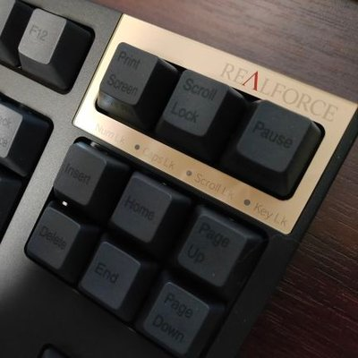
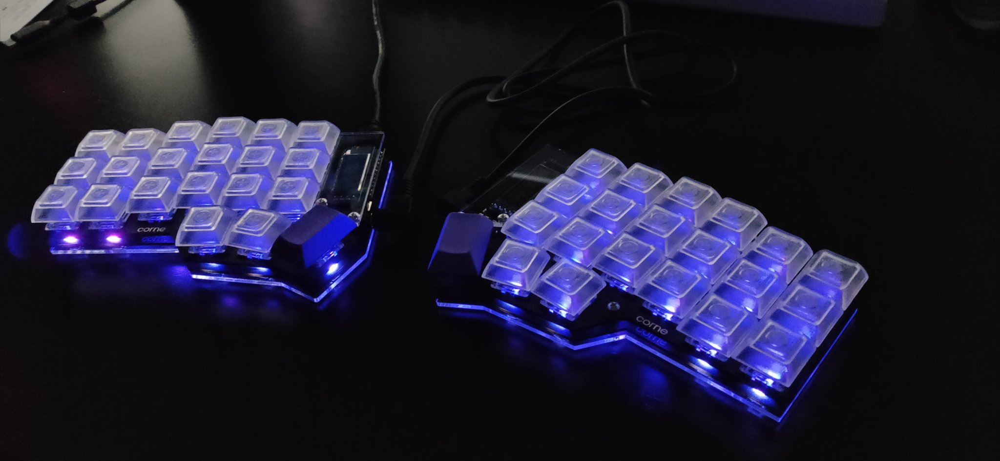
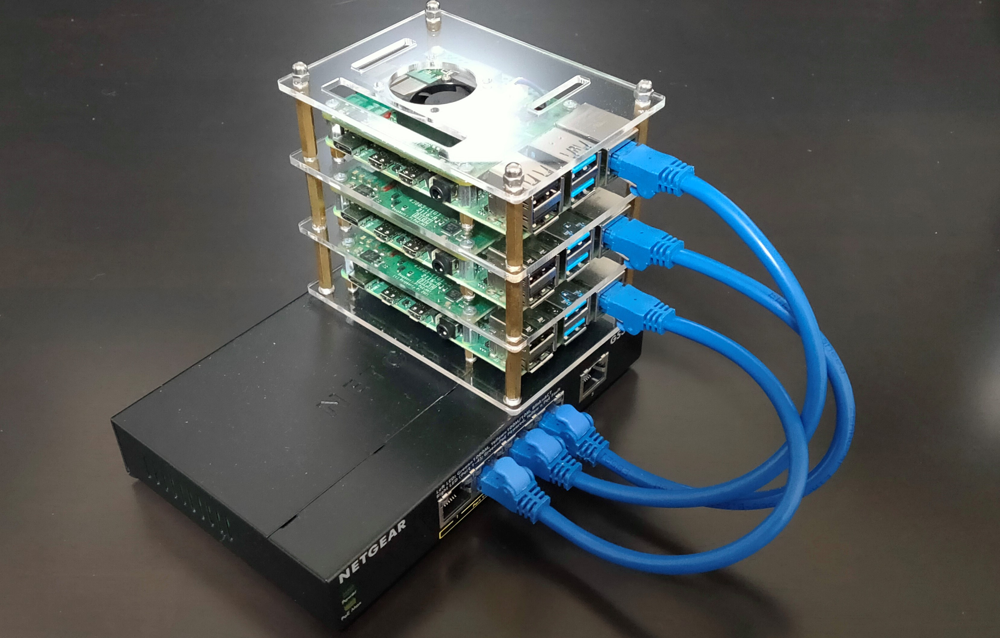

<!-- タイトル用書式：中央寄せ -->
<!-- _class : lead-->

# Self-introduction

---

# Profile

- Name:_sdmt
- Job:Product Owner,Software Engineer
- Certification: AWS SAA(SAA-C02)
- Like:
    - Agile
    - Kubernetes
    - Cloud
    - Self-Made Keyboard

---

# Self-Made Keyboard
- Corne Cherry

---

# My Kubernetes Cluster
- Raspberry Pi Cluster

---

# Work Experience
- Company：Certain IT company in Tokyo
- 2014~2017：Maintenance and development of mission-critical systems for insurance companies
    - Job：Developer,Team Leader
- 2018~2019:In-house service development
    - Job：Product Owner
- 2020~：R&D,Project support
    - Job：Product Owner,Cloud Architect,Tech Lead